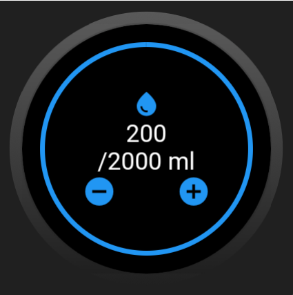

# Aqua reminder

    
    
    
    
  

A Water reminder app designed for wear os devices.

  

## ⚙️ Instalação dos 

`
flutter pub get
`

### Para executar a aplicação é necessario um emulador ou dispositivo android wear
